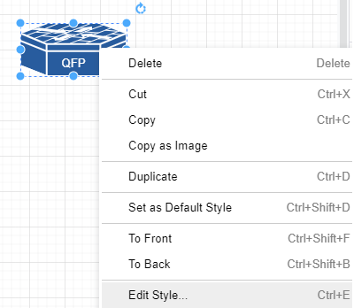
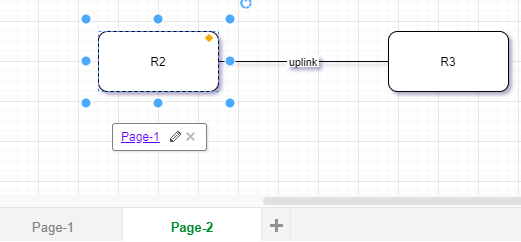

DrawIo Module 
===================

N2G Drawio Module supports producing XML structured text files that can be opened by Diagrams `DrawIO desktop <https://github.com/jgraph/drawio-desktop/releases>`_ or `DrawIO web <https://app.diagrams.net/>`_ applications

Quick start
-----------

Nodes and links can be added one by one using ``add_node`` and ``add_link`` methods

.. code-block:: python 

    from N2G import drawio_diagram
    
    diagram = drawio_diagram()
    diagram.add_diagram("Page-1")
    diagram.add_node(id="R1")
    diagram.add_node(id="R2")
    diagram.add_link("R1", "R2", label="DF", src_label="Gi1/1", trgt_label="GE23")
    diagram.layout(algo="kk")
    diagram.dump_file(filename="Sample_graph.drawio", folder="./Output/")

After opening and editing diagram, it might look like this:

.. raw:: html
    :file: _images/drawio/quick_start_example.svg

Working with drawio module should be started with adding new diagram, after that nodes and links can be added. It is possible to switch between diagrams to edit using ``go_to_diagram`` method. 

.. note:: link ``src_label`` and ``trgt_label`` attributes supported starting with 0.2.0 version

Adding styles
-------------

Styles used to change the way how things look and can be applied to nodes or links. Styles attributes in DrawIO encoded using strings similar to this one:

.. code-block:: python

    shape=mxgraph.cisco.misc.asr_1000_series;html=1;pointerEvents=1;dashed=0;fillColor=#036897;strokeColor=#ffffff;strokeWidth=2;verticalLabelPosition=bottom;verticalAlign=top;align=center;outlineConnect=0;
    
above strings can be found in node and link settings:

and can be used to reference by node and links style ``attribute``, additionally, style string can be saved in text file and ``style`` attribute can reference that file OS path location.

.. code-block:: python

    from N2G import drawio_diagram

    new_link_style="endArrow=classic;fillColor=#f8cecc;strokeColor=#FF3399;dashed=1;edgeStyle=entityRelationEdgeStyle;startArrow=diamondThin;startFill=1;endFill=0;strokeWidth=5;"
    building_style="shape=mxgraph.cisco.buildings.generic_building;html=1;pointerEvents=1;dashed=0;fillColor=#036897;strokeColor=#ffffff;strokeWidth=2;verticalLabelPosition=bottom;verticalAlign=top;align=center;outlineConnect=0;"
    
    diagram = drawio_diagram()
    diagram.add_diagram("Page-1")
    diagram.add_node(id="HQ", style=building_style, width=90, height=136)
    diagram.add_node(id="R1", style="./styles/router.txt")
    diagram.add_link("R1", "HQ", label="DF", style=new_link_style)

where `./styles/router.txt` content is::

    shape=mxgraph.cisco.routers.atm_router;html=1;pointerEvents=1;dashed=0;fillColor=#036897;strokeColor=#ffffff;strokeWidth=2;verticalLabelPosition=bottom;verticalAlign=top;align=center;outlineConnect=0;
    
After opening and editing diagram, it might look like this:

.. raw:: html
    :file: _images/drawio/styles_example.svg
    
.. note:: DrawIO does not encode node width and height attributes in style string, as a result width and height should be provided separately or will be set to default values: 120 and 60 pixels

Nodes and links data attributes
-------------------------------    

Data and URL attributes can be added to links and nodes to encode additional information. Data attribute should be a dictionary of key value pairs to add, where values can be of type string only. 

URL attribute can point to WEB link or can reference another diagram/tab name.

.. code-block:: python

    from N2G import drawio_diagram
    
    diagram = drawio_diagram()
    diagram.add_diagram("Page-1")
    diagram.add_node(id="R1", data={"a": "b", "c": "d"}, url="http://google.com")
    diagram.add_diagram("Page-2")
    diagram.add_node(id="R2", url="Page-1")
    diagram.add_node(id="R3")
    diagram.add_link("R2", "R3", label="uplink", data={"speed": "1G", "media": "10G-LR"}, url="http://cmdb.local")
    diagram.dump_file(filename="Sample_graph.drawio", folder="./Output/")
    
After opening and editing diagram, it might look like this:

Loading graph from dictionary
-----------------------------

Diagram elements can be loaded from dictionary structure. That dictionary may contain nodes, links and edges keys, these keys should contain list of dictionaries where each dictionary item will contain element attributes such as id, labels, data, url etc. 

.. code-block:: python 

    from N2G import drawio_diagram
    
    diagram = drawio_diagram()
    sample_graph={
    'nodes': [
        {'id': 'a', 'style': './styles/router.txt', 'label': 'R1', 'width': 78, 'height': 53}, 
        {'id': 'R2', 'label':'CE12800'}, 
        {'id': 'c', 'label': 'R3', 'data': {'role': 'access', 'make': 'VendorX'}}
    ], 
    'links': [
        {'source': 'a', 'label': 'DF', 'target': 'R2', 'data': {'role': 'uplink'}}, 
        {'source': 'R2', 'label': 'Copper', 'target': 'c'},
        {'source': 'c', 'label': 'ZR', 'target': 'a'}
    ]}
    diagram.from_dict(sample_graph, width=300, height=200, diagram_name="Page-2")
    diagram.layout(algo="kk")
    diagram.dump_file(filename="Sample_graph.drawio", folder="./Output/")

    
After opening and editing diagram, it might look like this:

.. raw:: html
    :file: _images/drawio/from_dict_example.svg

Loading graph from list
-----------------------

From list method allows to load graph from list of dictionaries, generally containing link details like source, target, label. Additionally source and target can be defined using dictionaries as well, containing nodes details.

.. note:: Non-existing node will be automatically added on first encounter, by default later occurrences of same node will not lead to node attributes change, that behavior can be changed setting ``node_duplicates`` drawio_diagram attribute equal to `update` value.

.. code-block:: python 

    from N2G import drawio_diagram
    
    diagram = drawio_diagram()
    sample_list_graph = [
        {'source': {'id': 'SW1'}, 'target': 'R1', 'label': 'Gig0/1--Gi2'},
        {'source': 'R2', 'target': 'SW1', "data": {"speed": "1G", "media": "10G-LR"}},
        {'source': {'id':'a', 'label': 'R3'}, 'target': 'SW1'},
        {'source': 'SW1', 'target': 'R4'}
    ]
    diagram.from_list(sample_list_graph, width=300, height=200, diagram_name="Page-2")
    diagram.layout(algo="kk")
    diagram.dump_file(filename="Sample_graph.drawio", folder="./Output/")

After opening and editing diagram, it might look like this:

.. raw:: html
    :file: _images/drawio/from_list_example.svg

Loading graph from csv
----------------------

Similar to ``from_dict`` or ``from_list``, from_csv method can take csv data with elements details and add them to diagram. Two types of csv table should be provided - one for nodes, another for links.

.. code-block:: python 

    from N2G import drawio_diagram
    
    diagram = drawio_diagram()
    csv_links_data = """"source","label","target"
    "a","DF","b"
    "b","Copper","c"
    "b","Copper","e"
    d,FW,e
    """
    csv_nodes_data=""""id","label","style","width","height"
    a,"R12","./styles/router.txt",78,53
    "b","R2",,,
    "c","R3",,,
    "d","SW22",,,
    "e","R1",,,
    """
    diagram.from_csv(csv_nodes_data)
    diagram.from_csv(csv_links_data)
    diagram.layout(algo="kk")
    diagram.dump_file(filename="Sample_graph.drawio", folder="./Output/")

After opening and editing diagram, it might look like this:

.. raw:: html
    :file: _images/drawio/from_csv_example.svg

Loading existing diagrams
-------------------------

N2G DrawIO module provides ``from_file`` and ``from_text`` methods to load existing diagram content, to load diagram from file one can use this as example:

.. code-block:: python

    from N2G import drawio_diagram
    
    diagram = drawio_diagram()
    drawing.from_file("./source/old_office_diagram.drawio")
    
After diagram loaded it can be modified or updated using ``add_x``, ``from_x``, ``delete_x`` or ``compare`` methods.

Diagram layout
--------------

To arrange diagram nodes in certain way one can use ``layout`` method that relies on `igraph library <https://igraph.org/2020/02/14/igraph-0.8.0-python.html>`_ to calculate node coordinates in accordance with certain algorithm. List of supported layout algorithms and their details can be found `here <https://igraph.org/python/doc/tutorial/tutorial.html#layout-algorithms>`_ together with brief description in `API Reference` section.

Sample code to layout diagram:

.. code-block:: python

    from N2G import drawio_diagram
    
    diagram = drawio_diagram()
    diagram.from_file("./source/old_office_diagram.graphml")
    diagram.layout(algo="drl")
    diagram.dump_file(filename="updated_office_diagram.graphml", folder="./Output/")

Comparing diagrams
------------------

Comparing diagrams can help to spot changes in your system. N2G ``compare`` method allow to calculate differences between old and new graphs and produce resulting diagram highlighting changes.

.. code-block:: python

    from N2G import drawio_diagram
    
    diagram = drawio_diagram()
    old_graph = {
    'nodes': [
        {'id': 'R1'}, {'id': 'R2'}, {'id': 'R3'},  
        ], 
    'edges': [
        {'source': 'R1', 'target': 'R2'}, 
        {'source': 'R2', 'target': 'R3'},
        {'source': 'R3', 'target': 'R1'}
    ]}
    new_graph = {
    'nodes': [
        {'id': 'R1'}, {'id': 'R2'}, {'id': 'R4'},  
        ], 
    'edges': [
        {'source': 'R1', 'target': 'R2'}, 
        {'source': 'R2', 'target': 'R4'}
    ]}
    diagram.add_diagram("Page-1", width=500, height=500)
    diagram.from_dict(old_graph)
    diagram.compare(new_graph)
    diagram.layout(algo="kk")
    diagram.dump_file(filename="Sample_graph.drawio", folder="./Output/")
    
Original and after diagrams combined:

.. raw:: html
    :file: _images/drawio/compare_example.svg
    
R3 and its links are missing - highlighted in gray, but R4 and its link is new - highlighted in green.

API reference
----------------------

API reference for N2G DrawIO module.

.. automodule:: N2G

.. autoclass:: drawio_diagram
   :members: