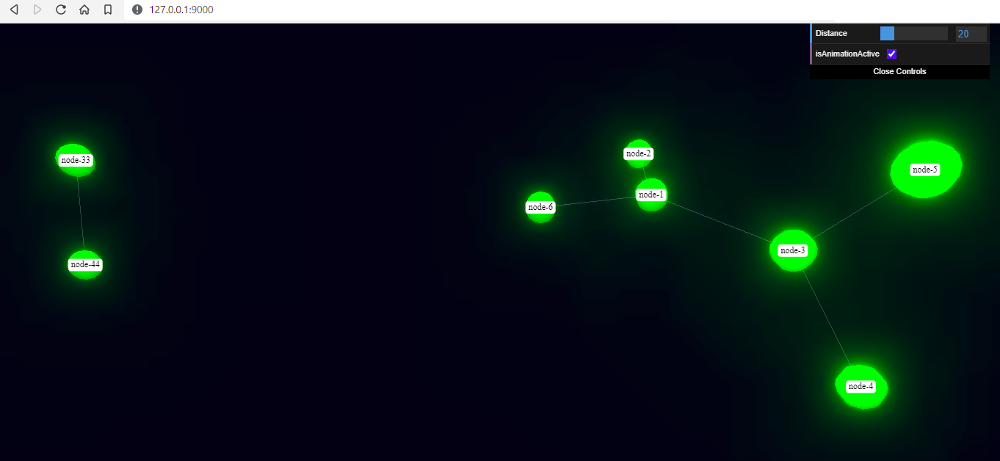

V3D Diagram Plugin
==================

Module to produce JSON structure compatible with `3D Force-Directed Graph <https://github.com/vasturiano/3d-force-graph>`_
library `JSON input syntax <https://github.com/vasturiano/3d-force-graph#input-json-syntax>`_

Why? Because network 3D visualisation is awesome. However, author is not aware of complete
application that is capable of displaying produced results utilizing
`3D Force-Directed Graph <https://github.com/vasturiano/3d-force-graph>`_ library. There is an
attempt to make such an application described in `Built-in Diagram Viewer`_ section, but it is
very (very) far from being perfect. Hence, if you are aware of better option to visualize data compatible
with `JSON input syntax <https://github.com/vasturiano/3d-force-graph#input-json-syntax>`_ please
let the author know about it.

Quick start
-----------

Nodes and links can be added one by one using ``add_node`` and ``add_link`` methods

.. code-block:: python

    from N2G import v3d_diagramm as create_v3d_diagram

    v3d_drawing = create_v3d_diagram()
    v3d_drawing.add_node(id="node-1")
    v3d_drawing.add_node(id="node-2")
    v3d_drawing.add_link("node-1", "node-2", label="link 1")
    v3d_drawing.dump_file()

After opening and editing produced JSON text file, it might look like this:

.. code-block:: python

    {
        "nodes": [
            {
                "id": "node-1",
                "label": "node-1",
                "color": "green",
                "nodeResolution": 8,
                "data": {}
            },
            {
                "id": "node-2",
                "label": "node-2",
                "color": "green",
                "nodeResolution": 8,
                "data": {}
            }
        ],
        "links": [
            {
                "id": "b35ebf8a6eeb7084dd9f3e14ec85eb9c",
                "label": "bla1",
                "source": "node-1",
                "target": "node-2",
                "src_label": "",
                "trgt_label": "",
                "data": {}
            }
        ]
    }

Nodes and links default attributes
----------------------------------

Node dictionaries have these attributes added by default:

* ``id`` - node unique identifier
* ``label`` - node label to display
* ``color`` - node color, default is green
* ``nodeResolution`` - how smooth node sphere is, default value is 8
* ``data`` - data dictionary

Link dictionaries have these attributes added by default:

* ``source`` - source node id
* ``target`` - target node id
* ``id`` - link unique identifier, calculated automatically if not supplied
* ``label`` - link label
* ``data`` - data dictionary
* ``src_label`` - link label to use next to source node
* ``trgt_label`` - link label to use next to target node

Loading graph from dictionary
-----------------------------

Graph can be loaded from dictionary data using ``from_dict`` method, sample code::

    from N2G import v3d_diagramm as create_v3d_diagram

    sample_data = {
        'links': [{'data': {}, 'label': 'bla1', 'source': 'node-1', 'src_label': '', 'target': 'node-2', 'trgt_label': ''},
                  {'data': {}, 'label': 'bla2', 'source': 'node-1', 'src_label': '', 'target': 'node-3', 'trgt_label': ''},
                  {'data': {}, 'label': 'bla3', 'source': 'node-3', 'src_label': '', 'target': 'node-5', 'trgt_label': ''},
                  {'data': {}, 'label': 'bla4', 'source': 'node-3', 'src_label': '', 'target': 'node-4', 'trgt_label': ''},
                  {'data': {}, 'label': 'bla77', 'source': 'node-33', 'src_label': '', 'target': 'node-44', 'trgt_label': ''},
                  {'data': {'cd': 123, 'ef': 456}, 'label': 'bla6', 'source': 'node-6', 'src_label': '', 'target': 'node-1', 'trgt_label': ''}],
        'nodes': [{'color': 'green', 'data': {}, 'id': 'node-1', 'label': 'node-1', 'nodeResolution': 16},
                  {'color': 'green', 'data': {}, 'id': 'node-2', 'label': 'node-2', 'nodeResolution': 8},
                  {'color': 'blue', 'data': {'val': 4}, 'id': 'node-3', 'label': 'node-3', 'nodeResolution': 8},
                  {'color': 'green', 'data': {}, 'id': 'node-4', 'label': 'node-4', 'nodeResolution': 8},
                  {'color': 'green', 'data': {}, 'id': 'node-5', 'label': 'node-5', 'nodeResolution': 8},
                  {'color': 'green', 'data': {'a': 'b', 'c': 'd'}, 'id': 'node-6', 'label': 'node-6', 'nodeResolution': 8},
                  {'color': 'green', 'data': {}, 'id': 'node-33', 'label': 'node-33', 'nodeResolution': 8},
                  {'color': 'green', 'data': {}, 'id': 'node-44', 'label': 'node-44', 'nodeResolution': 8},
                  {'color': 'green', 'data': {}, 'id': 'node-25', 'label': 'node-25', 'nodeResolution': 8}]
    }

    v3d_drawing = create_v3d_diagram()
    v3d_drawing.from_dict(sample_data)
    v3d_drawing.dump_file()

Loading graph from list
-----------------------

Graph can be loaded from list data using ``from_list`` method, sample code::

    from N2G import v3d_diagramm as create_v3d_diagram

    sample_data_list = [
        {'data': {}, 'label': 'bla1', 'source': {'id': 'node-1', 'nodeResolution': 16}, 'src_label': '', 'target': {'id': 'node-2'}, 'trgt_label': ''},
        {'data': {}, 'label': 'bla2', 'source': 'node-1', 'src_label': '', 'target': 'node-3', 'trgt_label': ''},
        {'data': {}, 'label': 'bla3', 'source': {'id': 'node-3'}, 'src_label': '', 'target': 'node-5', 'trgt_label': ''},
        {'data': {}, 'label': 'bla4', 'source': {'id': 'node-3', 'data': {'val': 4}}, 'src_label': '', 'target': 'node-4', 'trgt_label': ''},
        {'data': {}, 'label': 'bla77', 'source': 'node-33', 'src_label': '', 'target': 'node-44', 'trgt_label': ''},
        {'data': {'cd': 123, 'ef': 456}, 'label': 'bla6', 'source': {'id': 'node-6', 'data': {'a': 'b', 'c': 'd'}}, 'src_label': '', 'target': 'node-1', 'trgt_label': ''}
    ]

    v3d_drawing = create_v3d_diagram()
    v3d_drawing.from_list(sample_data_list)
    v3d_drawing.dump_file()

Loading existing diagrams
-------------------------

Existing `JSON input syntax <https://github.com/vasturiano/3d-force-graph#input-json-syntax>`_
data can be loaded into V3D plugin for processing and manipulation using sample code::

    from N2G import v3d_diagramm as create_v3d_diagram

    data = '''{
        "nodes": [
            {
            "id": "id1",
            "name": "name1",
            "val": 1
            },
            {
            "id": "id2",
            "name": "name2",
            "val": 10
            }
        ],
        "links": [
            {
                "source": "id1",
                "target": "id2"
            }
        ]
    }'''

    v3d_drawing = create_v3d_diagram()
    v3d_drawing.from_v3d_json(data)

Diagram layout
--------------

To arrange diagram nodes in certain way one can use ``layout`` method that relies on
`igraph library <https://igraph.org/2020/02/14/igraph-0.8.0-python.html>`_ to calculate
node coordinates in accordance with certain algorithm. List of supported layout algorithms
and their details can be found `here <https://igraph.org/python/doc/tutorial/tutorial.html#layout-algorithms>`_
together with brief description in `API Reference` section.

Sample code to layout diagram:

.. code-block:: python

    from N2G import v3d_diagramm as create_v3d_diagram

    sample_data_list = [
        {'data': {}, 'label': 'bla1', 'source': {'id': 'node-1', 'nodeResolution': 16}, 'src_label': '', 'target': {'id': 'node-2'}, 'trgt_label': ''},
        {'data': {}, 'label': 'bla2', 'source': 'node-1', 'src_label': '', 'target': 'node-3', 'trgt_label': ''},
        {'data': {}, 'label': 'bla3', 'source': {'id': 'node-3'}, 'src_label': '', 'target': 'node-5', 'trgt_label': ''},
        {'data': {}, 'label': 'bla4', 'source': {'id': 'node-3', 'data': {'val': 4}}, 'src_label': '', 'target': 'node-4', 'trgt_label': ''},
        {'data': {}, 'label': 'bla77', 'source': 'node-33', 'src_label': '', 'target': 'node-44', 'trgt_label': ''},
        {'data': {'cd': 123, 'ef': 456}, 'label': 'bla6', 'source': {'id': 'node-6', 'data': {'a': 'b', 'c': 'd'}}, 'src_label': '', 'target': 'node-1', 'trgt_label': ''}
    ]

    v3d_drawing = create_v3d_diagram()
    v3d_drawing.from_list(sample_data_list)
    v3d_drawing.layout(algo='kk3d', dx=200, dy=200, dz=200)

Where ``dx, dy and dz`` help to set diagram 3d size.

Built-in Diagram Viewer
-----------------------

V3D plugin comes with simple 3d diagram viewer for the purpose of demonstration and to explore
produced diagram.

Built in WEB server uses Flask in debug mode, hence not suitable for production use.

To install Flask WEB framework - ``pip install Flask``

Sample code to run built-in WEB server::

    from N2G import v3d_diagramm as create_v3d_diagram

    sample_data_list = [
        {'data': {}, 'label': 'bla1', 'source': {'id': 'node-1', 'nodeResolution': 16}, 'src_label': '', 'target': {'id': 'node-2'}, 'trgt_label': ''},
        {'data': {}, 'label': 'bla2', 'source': 'node-1', 'src_label': '', 'target': 'node-3', 'trgt_label': ''},
        {'data': {}, 'label': 'bla3', 'source': {'id': 'node-3'}, 'src_label': '', 'target': 'node-5', 'trgt_label': ''},
        {'data': {}, 'label': 'bla4', 'source': {'id': 'node-3', 'data': {'val': 4}}, 'src_label': '', 'target': 'node-4', 'trgt_label': ''},
        {'data': {}, 'label': 'bla77', 'source': 'node-33', 'src_label': '', 'target': 'node-44', 'trgt_label': ''},
        {'data': {'cd': 123, 'ef': 456}, 'label': 'bla6', 'source': {'id': 'node-6', 'data': {'a': 'b', 'c': 'd'}}, 'src_label': '', 'target': 'node-1', 'trgt_label': ''}
    ]

    v3d_drawing = create_v3d_diagram()
    v3d_drawing.from_list(sample_data_list)
    v3d_drawing.run(ip="0.0.0.0", "port"=9000)

If all good, browsing to ``http://127.0.0.1:9000`` URL should load similar to below 3D diagram:

API reference
-------------

API reference for N2G V3D module.

.. autoclass:: N2G.plugins.diagrams.N2G_V3D.v3d_diagramm
   :members: