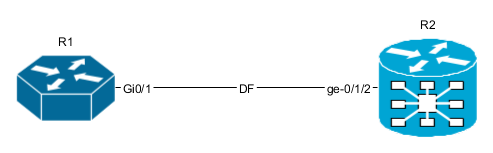
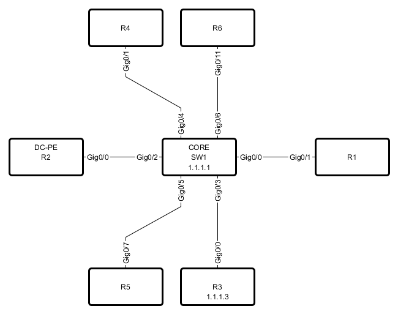

yEd Module 
================

N2G yEd Module supports producing graphml XML structured text files that can be opened by `yWorsk yEd Graph Editor <https://www.yworks.com/downloads#yEd>`_ or `yEd web application <https://www.yworks.com/yed-live/>`_.

Quick start
-----------

Nodes and links can be added one by one using ``add_node`` and ``add_link`` methods

.. code-block:: python 
        
    from N2G import yed_diagram
    
    diagram = yed_diagram()
    diagram.add_node('R1', top_label='Core', bottom_label='ASR1004')
    diagram.add_node('R2', top_label='Edge', bottom_label='MX240')
    diagram.add_link('R1', 'R2', label='DF', src_label='Gi0/1', trgt_label='ge-0/1/2')
    diagram.layout(algo="kk")
    diagram.dump_file(filename="Sample_graph.graphml", folder="./Output/")    
    
After opening and editing diagram, it might look like this:

.. raw:: html
    :file: _images/yed/quick_start_example.svg
    
Adding SVG nodes 
----------------

By default N2G uses shape nodes, but svg image can be sourced from directory on your system and used as node image instead. However, svg images as nodes can support only one label attribute, that label will be displayed above svg picture.

.. code-block:: python 
        
    from N2G import yed_diagram
    
    diagram = yed_diagram()
    diagram.add_node('R1', pic="router.svg", pic_path="./Pics/")
    diagram.add_node('R2', pic="router_edge.svg", pic_path="./Pics/")
    diagram.add_link('R1', 'R2', label='DF', src_label='Gi0/1', trgt_label='ge-0/1/2')
    diagram.layout(algo="kk")
    diagram.dump_file(filename="Sample_graph.graphml", folder="./Output/")    
    
After opening and editing diagram, it might look like this:

Nodes and links data attributes
-------------------------------

Description and URL attributes can be added to node and link. Description attribute can be used by yEd to search for elements as well as diagrams exported in svg format can display data attributes as a tooltips.

.. code-block:: python 
        
    from N2G import yed_diagram
    
    diagram = yed_diagram()
    diagram.add_node('R1', top_label='Core', bottom_label='ASR1004', description="loopback0: 192.168.1.1", url="google.com")
    diagram.add_node('R2', top_label='Edge', bottom_label='MX240', description="loopback0: 192.168.1.2")
    diagram.add_link('R1', 'R2', label='DF', src_label='Gi0/1', trgt_label='ge-0/1/2', description="link media-type: 10G-LR", url="github.com")
    diagram.layout(algo="kk")
    diagram.dump_file(filename="Sample_graph.graphml", folder="./Output/")
    
After opening and editing diagram, it might look like this:

.. raw:: html
    :file: _images/yed/nodes_links_data_url.svg
    
Node R1 and link should be clickable on above image as they contain URL information, tooltip should be displayed if svg will be open on its own.

Loading graph from dictionary
-----------------------------

Diagram elements can be loaded from dictionary structure. That dictionary may contain nodes, links and edges keys, these keys should contain list of dictionaries where each dictionary item will contain elements attributes such as id, labels, description etc. 

.. code-block:: python 

    from N2G import yed_diagram
    
    diagram = yed_diagram()
    sample_graph={
    'nodes': [
        {'id': 'a', 'pic': 'router.svg', 'label': 'R1' }, 
        {'id': 'R2', 'bottom_label':'CE12800', 'top_label':'1.1.1.1'}, 
        {'id': 'c', 'label': 'R3', 'bottom_label':'FI', 'top_label':'fns751', 'description': 'role: access'},
        {'id': 'd', 'pic':'firewall.svg', 'label': 'FW1', 'description': 'location: US'},
        {'id': 'R4', 'pic': 'router'}
    ], 
    'links': [
        {'source': 'a', 'src_label': 'Gig0/0\nUP', 'label': 'DF', 'target': 'R2', 'trgt_label': 'Gig0/1', 'description': 'role: uplink'}, 
        {'source': 'R2', 'src_label': 'Gig0/0', 'label': 'Copper', 'target': 'c', 'trgt_label': 'Gig0/2'},
        {'source': 'c', 'src_label': 'Gig0/0', 'label': 'ZR', 'target': 'a', 'trgt_label': 'Gig0/3'},
        {'source': 'd', 'src_label': 'Gig0/10', 'label': 'LR', 'target': 'c', 'trgt_label': 'Gig0/8'},
        {'source': 'd', 'src_label': 'Gig0/11', 'target': 'R4', 'trgt_label': 'Gig0/18'}
    ]}
    diagram.from_dict(sample_graph)
    diagram.layout(algo="kk")
    diagram.dump_file(filename="Sample_graph.graphml", folder="./Output/")
    
After opening and editing diagram, it might look like this:

.. raw:: html
    :file: _images/yed/from_dict_example.svg

Loading graph from list
-----------------------

From list method allows to load graph from list of dictionaries, generally containing link details like source, target, labels. Additionally source and target can be defined using dictionaries as well, containing nodes details.

.. note:: Non-existing node will be automatically added on first encounter, by default later occurrences of same node will not lead to node attributes change, that behavior can be changed setting ``node_duplicates`` yed_diagram attribute equal to `update` value.

.. code-block:: python 

    from N2G import yed_diagram

    diagram = yed_diagram()
    sample_list_graph = [
        {'source': {'id': 'SW1', 'top_label': 'CORE', 'bottom_label': '1,1,1,1'}, 'src_label': 'Gig0/0', 'target': 'R1', 'trgt_label': 'Gig0/1'},
        {'source': {'id': 'R2', 'top_label': 'DC-PE'}, 'src_label': 'Gig0/0', 'target': 'SW1', 'trgt_label': 'Gig0/2'},
        {'source': {'id':'R3', 'bottom_label': '1.1.1.3'}, 'src_label': 'Gig0/0', 'target': 'SW1', 'trgt_label': 'Gig0/3'},
        {'source': 'SW1', 'src_label': 'Gig0/4', 'target': 'R4', 'trgt_label': 'Gig0/1'},
        {'source': 'SW1', 'src_label': 'Gig0/5', 'target': 'R5', 'trgt_label': 'Gig0/7'},
        {'source': 'SW1', 'src_label': 'Gig0/6', 'target': 'R6', 'trgt_label': 'Gig0/11'}
    ]
    diagram.from_list(sample_list_graph)
    diagram.dump_file(filename="Sample_graph.graphml", folder="./Output/")

After opening and editing diagram, it might look like this:

        
Loading graph from csv
----------------------

Similar to ``from_dict`` or ``from_list`` methods, from_csv method can take csv data with elements details and add them to diagram. Two types of csv table should be provided - one for nodes, another for links.

.. code-block:: python 

    from N2G import yed_diagram
    
    diagram = yed_diagram()
    csv_links_data = """"source","src_label","label","target","trgt_label","description"
    "a","Gig0/0\nUP","DF","R1","Gig0/1","vlans_trunked: 1,2,3\nstate: up"
    "R1","Gig0/0","Copper","c","Gig0/2",
    "R1","Gig0/0","Copper","e","Gig0/2",
    d,Gig0/21,FW,e,Gig0/23,
    """
    csv_nodes_data=""""id","pic","label","bottom_label","top_label","description"
    a,router,"R12",,,
    "R1",,,"SGD1378","servers",
    "c",,"R3","SGE3412","servers","1.1.1.1"
    "d","firewall.svg","FW1",,,"2.2.2.2"
    "e","router","R11",,,
    """
    diagram.from_csv(csv_nodes_data)
    diagram.from_csv(csv_links_data)
    diagram.dump_file(filename="Sample_graph.graphml", folder="./Output/")

After opening and editing diagram, it might look like this:

.. raw:: html
    :file: _images/yed/from_csv_example.svg
    
Loading existing diagrams
-------------------------

N2G yEd module uses custom ``nmetadata`` and ``emetadata`` attributes to store original node and link id. For nodes, ``nmetadata`` contains node id in a format ``{'id': 'node_id_value'}``, for links ``emetadata`` contains source and target node ids as well as link id, e.g. ``{"sid": "SW1", "tid": "R6", "id": "8e96ade0d90d33c3308721dc2a53b391"}``, where link id calculated using rules described in `API reference` section.

``nmetadata`` and ``emetadata`` custom attributes used to properly load previously produced diagrams for modification, as a result:

.. warning:: currently, N2G yEd module can properly load only diagrams that were created by this module in the first place or diagrams that had manually added ``nmetadata`` and ``emetadata`` attributes.

N2G yEd module provides ``from_file`` and ``from_text`` methods to load existing diagram content, to load diagram from file one can use this as example:

.. code-block:: python

    from N2G import yed_diagram
    
    diagram = yed_diagram()
    diagram.from_file("./source/diagram_old.graphml")
    
After diagram loaded it can be modified or updated using ``add_x``, ``from_x``, ``delete_x`` or ``compare`` methods.

Diagram layout
--------------

To arrange diagram nodes in certain way one can use ``layout`` method that relies on `igraph library <https://igraph.org/2020/02/14/igraph-0.8.0-python.html>`_ to calculate node coordinates in accordance with certain algorithm. List of supported layout algorithms and their details can be found `here <https://igraph.org/python/doc/tutorial/tutorial.html#layout-algorithms>`_ together with brief description in `API Reference` section.

Sample code to layout diagram:

.. code-block:: python

    from N2G import yed_diagram
    
    diagram = yed_diagram()
    diagram.from_file("./source/diagram_old.graphml")
    diagram.layout(algo="drl", width=500, height=500)
    diagram.dump_file(filename="Sample_graph.graphml", folder="./Output/")

Comparing diagrams
------------------

Comparing diagrams can be useful to spot changes in your system. N2G ``compare`` method allow to calculate differences between old and new graphs and produce resulting diagram highlighting changes.

.. code-block:: python

    from N2G import yed_diagram
    
    diagram = yed_diagram()
    old_graph = {
    'nodes': [
        {'id': 'R1'}, {'id': 'R2'}, {'id': 'R3'},  
        ], 
    'edges': [
        {'source': 'R1', 'target': 'R2'}, 
        {'source': 'R2', 'target': 'R3'},
        {'source': 'R3', 'target': 'R1'}
    ]}
    new_graph = {
    'nodes': [
        {'id': 'R1'}, {'id': 'R2'}, {'id': 'R4'},  
        ], 
    'edges': [
        {'source': 'R1', 'target': 'R2'}, 
        {'source': 'R2', 'target': 'R4'}
    ]}
    diagram.from_dict(old_graph)
    diagram.compare(new_graph)
    diagram.layout(algo="kk", width=500, height=500)
    diagram.dump_file(filename="Sample_graph.graphml", folder="./Output/")
	
Original and after diagrams:

.. image:: _images/yed/compare_example.png

R3 and its links are missing - highlighted in gray, but R4 and its link is new - highlighted in green.
    
API reference
-------------

API reference for N2G yEd module.

.. automodule:: N2G

.. autoclass:: yed_diagram
   :members: